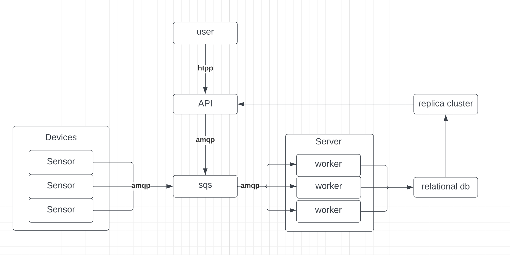

# SPS (Smart Parking System)
## Project description 
The Smart Parking System for Study is a project aimed at simulating a parking management system using scripts to  emulate devices. The system will process the data from the emulated devices and will be able to show statistics overall or for some certain user. User will be able to communicate back with the system to book a parking space.

The system will consist of a network of emulated sensors that will be placed in parking spots to detect the presence or absence of vehicles. These sensors will communicate with a central server, allowing the server to monitor the status of each parking spot.

Drivers will be able to access the system through an API that will provide parking spot availability. The API will also allow drivers to reserve a parking spot in advance, ensuring that they have a spot available when they arrive.
## Functionality description
* Sensors can send data to the system about events
    * spot became available
    * spot is in usage
    * approving bookig
* users can get information about
    * their parking statistics
    * parking statistic for some city
    * parking statistic for some spot
    * history for user
    * history for spot
* users can book a free spot
## Architecture MVP description

## Additional possibilities
1. use Redis for cache
2. use load balancer + cluster of db replicas
3. create a cluster for sqs
4. use load balancer + lead-lead replication